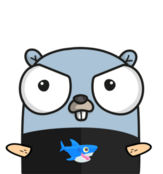

[](https://www.digitalocean.com/?refcode=b80d3d6467e1&utm_campaign=Referral_Invite&utm_medium=Referral_Program&utm_source=badge)

[](https://circleci.com/gh/alexfalkowski/infraops)
[](https://codecov.io/gh/alexfalkowski/infraops)
[](https://goreportcard.com/report/github.com/alexfalkowski/infraops/v2)
[](https://pkg.go.dev/github.com/alexfalkowski/infraops/v2)
[](https://masterminds.github.io/stability/active.html)

# 🧭 InfraOps

A Go-based infrastructure “monorepo” powered by **Pulumi**, with configuration stored as **HJSON** and decoded into a **protobuf schema**.

> [!NOTE]
> This repository is the operational source for several personal infrastructure areas. Prefer previews and narrow area changes before applying updates.

## 🗺️ Overview

This repository manages multiple infrastructure “areas”:

- `area/apps`: Kubernetes applications deployed to a cluster.
- `area/cf`: Cloudflare resources (zones, DNS records, R2 buckets/custom domains).
- `area/do`: DigitalOcean resources (VPC + Kubernetes clusters).
- `area/gh`: GitHub repositories and settings (branch protection, Pages, collaborators).
- `area/k8s`: Cluster add-ons installed via `helm`/`kubectl` (Makefile driven, not Pulumi).

Each Pulumi area has:

- a Pulumi entrypoint at `area/<name>/main.go`
- a config file at `area/<name>/<name>.hjson`
- a Pulumi project file `area/<name>/Pulumi.yaml`

Shared implementation lives under `internal/` (e.g. `internal/app`, `internal/cf`, `internal/do`, `internal/gh`).

## 🧰 Tooling

### 🧱 Development tools

Development and CI-style commands use:

- Go (version declared in `go.mod`)
- `make`
- Ruby, used by shared lint helpers under `bin/`
- Pulumi CLI
- `buf` for protobuf linting, breaking-change checks, and code generation
- `fieldalignment` for `make lint`
- `golangci-lint` for `make lint` when installed in `PATH`
- `shellcheck` for `make scripts-lint`
- `gotestsum` for `make specs`
- `govulncheck` and Trivy for `make sec`

### 🛠️ Operator tools

Infrastructure operation also uses:

- Pulumi: <https://www.pulumi.com/>
- kubectl: <https://kubernetes.io/docs/reference/kubectl/>
- Helm: <https://helm.sh/>
- kube-score: <https://kube-score.com/>
- doctl: <https://docs.digitalocean.com/reference/doctl/>
- kubescape: <https://kubescape.io/>
- curl: <https://curl.se/>
- vegeta: <https://github.com/tsenart/vegeta>

Operator-only helper targets use these tools as needed:

- `make -C area/apps save-config` and `make -C area/k8s save-config`: `doctl`
- `make -C area/apps setup|delete|rollout`: `kubectl`
- `make -C area/apps lint`: `kube-score`, `kubescape`, `kubectl` (live `lean` namespace scan)
- `make -C area/apps verify`: `curl`
- `make -C area/apps load`: `vegeta`
- `make -C area/k8s setup|delete|pods`: `helm`, `kubectl`

## 🧾 Configuration (HJSON + Protobuf Schema)

All area configuration files are **HJSON** (`*.hjson`). They are decoded into protobuf messages defined in:

- `api/infraops/v2/service.proto`

Those protobuf messages are then converted into internal Go types and used to provision resources.

The protobuf types provide the expected configuration shape. Semantic checks that are not modeled in the schema may still fail later during Pulumi or provider operations.

The top-level `version` field in each HJSON file is the configuration schema version used by this
repo's tooling. It is not a Kubernetes, provider, Pulumi, or application runtime version.

### 🧹 Format and Normalize Config

This repo includes a small CLI to normalize/format config files by:

1. decoding the HJSON into the appropriate protobuf message
2. writing it back out in a canonical form

Build:

```bash
make build-format
```

Format a config kind (`apps|cf|do|gh`), using the default location `area/<kind>/<kind>.hjson`:

```bash
./format -k cf
```

Override the path:

```bash
./format -k cf -p area/cf/cf.hjson
```

The selected kind must match the file's area-specific fields. A mismatch is rejected
without changing the file.

### 📝 Config Schema Notes

A few conventions are implemented by the Go code and are worth knowing when editing HJSON:

#### 🧭 `Application.kind` Deployment Model (apps)

Supported values:

- `"internal"`: uses image tag `docker.io/alexfalkowski/<name>:v<version>`, mounts the app config file and listed secret volumes, injects `SERVICE_ID`, runs the container with `server`, and exposes debug `6060`, HTTP `8080`, and gRPC `9090`.
- `"external"`: uses image tag `docker.io/alexfalkowski/<name>:<version>`, skips app config and secret volume mounts, and exposes only HTTP `8080`.

Other values are unsupported and are not pre-validated by the helper code; malformed values may fail
later during Pulumi/Kubernetes application.

Internal apps also receive CircleCI release-agent labels/annotations and must serve HTTP
liveness/readiness probes at `/<name>/livez` and `/<name>/readyz` on port `8080`; startup uses a TCP
probe on `8080`. External apps skip CircleCI release-agent labels/annotations and use `/` for HTTP
liveness plus TCP readiness/startup probes on `8080`.

#### 🪪 `Application.id` CircleCI Project ID (apps)

For internal apps, `Application.id` is written to the deployment annotation
`circleci.com/project-id`. Keep it aligned with the CircleCI project identifier when adding or
renaming internal apps. External apps do not receive CircleCI release-agent labels or annotations.

#### 🔐 `EnvVar.value` Secret References (apps)

Environment variables support literal values, and a secret reference format:

- `secret:<secretName>/<key>`

At deploy time, this becomes a Kubernetes `SecretKeyRef`:

- Secret name: `<secretName>-secret`
- Secret key: `<key>`

The format is intentionally not pre-validated by the helper code; malformed references are expected
to fail during Pulumi/Kubernetes application.

Example:

```hjson
env_vars: [
  { name: "DATABASE_URL", value: "secret:db/url" }
]
```

#### 🧩 `Application.secrets` vs Secret Env Vars (apps)

- `Application.secrets` is an **application-level dependency list** used by the deployment implementation to wire existing Kubernetes Secrets as volumes.
- Secret references in `env_vars` (the `secret:<secretName>/<key>` format) reference **specific keys** in those secrets.
- They often use the same `<secretName>` values, but they serve different purposes.
- The app program does not create Secret objects or define Secret keys. For internal apps, each listed secret is expected to exist as `<secretName>-secret` and is mounted at `/etc/secrets/<secretName>`.

#### 📏 `Application.resource` Sizing (apps)

`Application.resource` selects a resource profile. Current mapping:

- `"small"` (default): cpu `125m-250m`, memory `64Mi-128Mi`, ephemeral-storage `1Gi-2Gi`

Unknown values fall back to `"small"`.

#### 🔢 `Application.replicas` Pod Count (apps)

Always set `replicas` explicitly; there is no fallback to three. Because this is a plain proto3
scalar, omission decodes to zero. Use `replicas: 0` explicitly when the application should run no pods.
Canonical rewrites by the format or bump tool may omit an explicit zero; that does not change the
deployed replica count.

```hjson
replicas: 3
```

> [!WARNING]
> `replicas: 1` is valid, but the current rolling update and PodDisruptionBudget both allow one
> unavailable pod, so it does not guarantee continuous availability during disruption or rollout.

#### 🛡️ App NetworkPolicy Baseline

The apps Pulumi program creates a `NetworkPolicy` that selects each app's pods. Ingress is limited
to the ports exposed by the app kind: external apps expose HTTP on `8080`, while internal apps expose
debug on `6060`, HTTP on `8080`, and gRPC on `9090`. Egress currently remains open because outbound
traffic flows are not modeled per app yet. Future egress restrictions should be introduced per
namespace/app after the required flows are known.

## 🔁 Common Workflows

### 🚚 Checkout / Bootstrap

The root `Makefile` includes shared build tooling from the `bin` submodule. Initialize it before running Make targets from a fresh checkout:

```bash
git submodule sync
git submodule update --init
```

### ✅ Dependencies, Linting, Tests, and Security

> [!IMPORTANT]
> Run `make dep` before local validation after checkout, dependency changes, or generated/vendor-state changes.

From the repository root:

```bash
make dep          # download/tidy/vendor deps
make lint         # lint Go sources (including field alignment)
make scripts-lint # lint repository shell workflow helpers
make sec          # govulncheck + Trivy
make specs        # gotestsum + go test (junit/coverage under test/reports)
make coverage     # HTML + function coverage under test/reports
```

### 🧬 Protobuf / API

> [!IMPORTANT]
> Do not edit generated Go code under `api/infraops/v2/*.pb.go` directly.

Instead:

```bash
make api-lint
make api-breaking
make api-generate
```

(Or: `make -C api lint|breaking|generate`.)

`make api-breaking` compares the API module against the GitHub `master` branch, so it needs network
access to run outside CI.

## 🚀 Pulumi: Preview/Update Per Area

Pulumi is typically run via Makefile targets from the repo root.

Login:

```bash
make pulumi-login
```

### 🔑 Provider Credentials

Pulumi also needs the provider credentials for the area being previewed or updated:

| Area | Required local access |
| ---- | --------------------- |
| `apps` | Kubernetes access through the current kubeconfig context |
| `cf` | `CLOUDFLARE_API_TOKEN` and `CLOUDFLARE_ACCOUNT_ID` |
| `do` | `DIGITALOCEAN_TOKEN` |
| `gh` | `GITHUB_TOKEN` |

Preview/update:

```bash
make area=cf pulumi-preview
make area=cf pulumi-update
```

Supported areas for these targets:

- `apps`, `cf`, `do`, `gh`

The Makefile runs Pulumi with:

- stack: `alexfalkowski/<area>/prod`
- working directory: `area/<area>`

That working directory matters because the programs read `<area>.hjson` via a relative path.

Other stack operations:

```bash
make area=cf pulumi-refresh
make area=cf pulumi-cancel
make area=cf pulumi-delete
```

> [!WARNING]
> `pulumi-update`, `pulumi-refresh`, and `pulumi-cancel` affect remote infrastructure or stack state. The Make targets pass `--yes`, so treat the preview as the confirmation step unless you are recovering from a known failed operation.

> [!CAUTION]
> `pulumi-delete` runs `pulumi stack rm --force`; it removes Pulumi stack state and can orphan managed resources if they still exist.

## 🧭 Areas

### 📦 Applications (`area/apps`)

Deploys Kubernetes applications described in `area/apps/apps.hjson`.

#### ⚙️ Configure

See:

- `area/apps/apps.hjson`

This file uses the `Kubernetes` message in `api/infraops/v2/service.proto`.

Internal apps also need an application config file at:

- `area/apps/<namespace>/<app>.yaml`

For example, the `bezeichner` app in namespace `lean` reads `area/apps/lean/bezeichner.yaml`.
The apps Pulumi program turns that file into a Kubernetes ConfigMap entry named `<app>.yaml`,
then mounts it into the container at `/etc/<app>/<app>.yaml`.

Only applications listed in `area/apps/apps.hjson` are deployed. The tracked files under
`area/apps/fiction/` are example app configs and are not used unless a matching app entry references
that namespace/name.

Adding an application to `apps.hjson` only wires the Pulumi resources. To include it in release
rollout, verify, and load workflows, also update `area/apps/release` with the app name and its
per-app rollout, verify, and load commands, including any request payload fixture needed by load
testing.

#### 🏗️ Install / Setup

Save the cluster kubeconfig if your local context is not already configured:

```bash
make -C area/apps save-config
```

Prepare the local app namespace/helper resources:

```bash
make -C area/apps setup
```

Apply the Pulumi resources described by `apps.hjson`:

```bash
make area=apps pulumi-update
```

#### 🧪 App Helpers

The default `rollout`, `verify`, and `load` helper targets are release-aware. They inspect the app
release diff and target only apps with version-only changes in `area/apps/apps.hjson`; when the diff
is not a release-only app change, they fall back to all supported apps.

Supported apps are the apps explicitly wired in `area/apps/release`. The `verify` helpers use
fail-fast `curl` requests with bounded connection and total request time, and the `load` helpers run
Vegeta and fail unless every request succeeds. Load request payloads live with the app fixtures under
`area/apps/<namespace>/`.

The release helper compares `APPS_RELEASE_BASE` to `APPS_RELEASE_HEAD` when those environment
variables are set. Otherwise it uses the current commit's parent, falling back to `origin/master`
when the parent is unavailable. In CI, `area/apps/release halt-ci` halts the general build for a
release-only apps version bump so the apps update workflow can run the targeted Pulumi update,
verification, load, and live-resource lint path. Set `APPS_RELEASE_DRY_RUN=true` to print the
release helper action instead of running it.

```bash
make -C area/apps rollout
make -C area/apps verify
make -C area/apps load
```

Use the `*-all` targets when you want to cover every supported app explicitly:

```bash
make -C area/apps rollout-all
make -C area/apps verify-all
make -C area/apps load-all
```

The `load*` targets write ignored vegeta result files under `area/apps/lean/*.bin`.

Per-app commands are exposed by the release helper:

```bash
cd area/apps
./release verify-web
./release load-bezeichner
./release rollout-standort
```

The `lint` target reads live resources from the `lean` namespace and scans them with kube-score and
kubescape; it requires a working cluster context. The kube-score helper intentionally ignores the
host pod anti-affinity check and fails when Kubernetes discovery or manifest collection returns no
live resources.

#### 🗑️ Delete

> [!CAUTION]
> This deletes the `lean` namespace through `kubectl`.

```bash
make -C area/apps delete
```

#### ⬆️ Update an Application Version (bump tool)

Build:

```bash
make build-bump
```

Update a single app version in config. This is an internal helper used by automation, and the
`-v` value is expected to be a semantic version:

```bash
./bump -n bezeichner -v <version>
```

By default it edits `area/apps/apps.hjson`. Override path:

```bash
./bump -n bezeichner -v <version> -p area/apps/apps.hjson
```

> [!TIP]
> Run `./format -k apps` after edits to keep config normalized.

### ☁️ Cloudflare (`area/cf`)

Manages Cloudflare resources using Pulumi’s Cloudflare provider:

- <https://www.pulumi.com/registry/packages/cloudflare/>

Config:

- `area/cf/cf.hjson`

#### 🌐 Zone Models

The shared Cloudflare zone baseline enables HTTPS, the code-defined minimum TLS setting, aggressive
caching, HTTP/3, and HTTP/2 prioritization, disables email obfuscation, and applies the SSL mode for
the zone model.

`balancer_zones` create a Cloudflare zone plus proxied A and AAAA records for each configured
`record_names` entry under the zone domain. Balancer zones use the shared baseline with SSL mode
`full`.

```hjson
balancer_zones: [
  {
    name: example
    domain: example.com
    ipv4: 203.0.113.10
    ipv6: 2001:db8::10
    record_names: [
      api
      web
    ]
  }
]
```

`page_zones` create a Cloudflare zone plus a proxied `www.<domain>` CNAME to `host`. Page zones use
the shared baseline with SSL mode `strict`.

```hjson
page_zones: [
  {
    name: docs
    domain: example.com
    host: example.github.io
  }
]
```

#### 🪣 R2 Buckets

R2 buckets are optional. Omit `zone` to create only the bucket. Include `zone` to create an enabled
R2 custom domain using the code-defined TLS minimum:

```hjson
buckets: [
  {
    name: assets
    region: EEUR
    zone: {
      id: "<cloudflare-zone-id>"
      domain: assets.example.com
    }
  }
]
```

#### 🔑 Required Environment Variables

Cloudflare Pulumi runs require:

- `CLOUDFLARE_API_TOKEN` for provider authentication
- `CLOUDFLARE_ACCOUNT_ID` for account-scoped resources like R2 buckets

### 🌊 DigitalOcean (`area/do`)

Manages DigitalOcean resources using Pulumi’s DigitalOcean provider:

- <https://www.pulumi.com/registry/packages/digitalocean/>

Config:

- `area/do/do.hjson`

#### 📐 Cluster Defaults

The DigitalOcean program creates the cluster VPC and then provisions the cluster with fixed
operational defaults:

- Region: `fra1`
- Kubernetes version: pinned in code
- Node count: `2`
- Maintenance window: any day at `23:00`
- Associated resources: destroyed with the cluster

Cluster `resource` values map to node capacity:

- `"small"` (default): 2 vCPU / 4 GB node
- `"medium"`: 4 vCPU / 8 GB node

Unknown or empty values fall back to `"small"`.

#### 🧱 Manual Prerequisites (DigitalOcean UI)

Some items may be created manually depending on account setup:

- A default project (example):

| Name          | Description                           |
| ------------- | ------------------------------------- |
| lean-thoughts | All experiments for lean-thoughts. |

The Pulumi program creates the VPC used by the cluster and attaches the cluster to it.

#### ⬆️ Kubernetes Cluster Upgrades

Cluster version is pinned in code:

- `internal/do/do.go`

Guidance:

- Patch versions can be updated in code.
- Minor/major upgrades should be initiated via the DigitalOcean UI (per DO guidance), then aligned in code.

### 🐙 GitHub (`area/gh`)

Manages GitHub resources using Pulumi’s GitHub provider:

- <https://www.pulumi.com/registry/packages/github/>

Config:

- `area/gh/gh.hjson`

This area was inspired by:

- <https://github.com/dirien/pulumi-github>

#### 🧱 Repository Baseline

Every managed repository receives a fixed baseline in addition to the HJSON fields: merge commits
and rebase merges are disabled, squash merge, auto-merge, update branch, auto-init, branch deletion
on merge, issues, projects, wiki, secret scanning, push protection, and vulnerability alerts are
enabled, and web commit signoff is disabled. These settings are intentional and are not configurable
in HJSON.

#### 🧬 Repository Templates

`template` creates a repository from another GitHub template repository and requires both `owner` and
`repository`. `is_template` is separate: it marks the resulting repository as a reusable template.

```hjson
is_template: true
template: {
  owner: alexfalkowski
  repository: go-service-template
}
```

#### 🛡️ Branch Protection Baseline

Every repository must list at least one `checks` entry. Those values become the required status
check contexts for strict branch protection on `master`; an empty list fails during provisioning.

Branch protection also enforces linear history and intentionally requires zero approving PR reviews
because required status checks are the primary merge gate for this solo-maintainer workflow.

#### 🪜 Repository Creation Caveat (2-step enablement)

Some repository features may require a two-step approach: create the repository first, then enable features in a follow-up change. This avoids timing issues around initial default branch creation.

##### 📄 GitHub Pages

First change: disable Pages (or omit pages config):

```hjson
pages: { enabled: false }
```

Second change: enable Pages:

```hjson
pages: { enabled: true }
```

Optional CNAME:

```hjson
pages: {
  enabled: true
  cname: www.yoursite.com
}
```

Pages uses legacy GitHub Pages sourced from `master`; branch, path, and build type are not
configurable in HJSON.

##### 👥 Collaborators

When enabled, collaborator management grants `push` permission to `lean-thoughts-ci`
on `alexfalkowski/<repository>`.

First change:

```hjson
collaborators: { enabled: false }
```

Second change:

```hjson
collaborators: { enabled: true }
```

If the pipeline fails due to timing, a rerun often succeeds.

### ⚓ Kubernetes Add-ons (`area/k8s`)

This is not a Pulumi area. It contains cluster add-ons installed via `helm`/`kubectl`.
These targets are intended to be run manually from an operator workstation, not from CI.

> [!CAUTION]
> Run this only after you have a Kubernetes cluster, a kubeconfig context for that cluster, and the required local secrets.

Save the cluster kubeconfig if your local context is not already configured:

```bash
make -C area/k8s save-config
```

Setup:

```bash
make -C area/k8s setup
```

The nginx ingress add-on uses the Helm values in `area/k8s/nginx/values.yaml`. Those values restrict
the DigitalOcean load balancer allow rules to Cloudflare CIDR ranges, so the ingress is intended for
Cloudflare-proxied origin traffic. Direct clients or non-Cloudflare DNS paths may be blocked at the
load balancer.

Delete:

> [!CAUTION]
> This deletes the `nginx-ingress`, `circleci`, and `metrics-server` namespaces through `kubectl`.

```bash
make -C area/k8s delete
```

Useful debugging:

```bash
make -C area/k8s pods
```

#### 🔑 Required Environment Variables

The default `make -C area/k8s setup` path installs the CircleCI release agent along with nginx ingress and metrics-server.

> [!IMPORTANT]
> `CIRCLECI_K8S_TOKEN` is required when running the default k8s setup target.

- `CIRCLECI_K8S_TOKEN` (CircleCI release agent)

Because the Makefile is a local-operator workflow, the CircleCI release-agent token is passed
directly to Helm rather than through a CI secret-handling path.

## 🗂️ Repository Structure

- `area/`: Pulumi programs and k8s add-ons
- `internal/`: shared implementation (convert + create patterns per area)
- `api/`: protobuf schema and generated code
- `cmd/`: small helper CLIs (`format`, `bump`)
- `bin/`: shared build tooling (git submodule)
