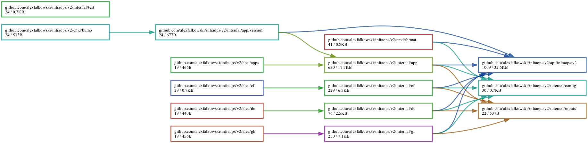

[](https://circleci.com/gh/alexfalkowski/infraops)
[](https://codecov.io/gh/alexfalkowski/infraops)
[](https://goreportcard.com/report/github.com/alexfalkowski/infraops/v2)
[](https://pkg.go.dev/github.com/alexfalkowski/infraops/v2)
[](https://masterminds.github.io/stability/active.html)

A Go-based infrastructure “monorepo” powered by **Pulumi**, with configuration stored as **HJSON** and validated/decoded using a **protobuf schema**.

## Overview

This repository manages multiple infrastructure “areas”:

- `area/apps`: Kubernetes applications deployed to a cluster.
- `area/cf`: Cloudflare resources (zones, DNS records, R2 buckets/custom domains).
- `area/do`: DigitalOcean resources (VPC + Kubernetes clusters).
- `area/gh`: GitHub repositories and settings (branch protection, Pages, collaborators).
- `area/k8s`: Cluster add-ons installed via `helm`/`kubectl` (Makefile driven, not Pulumi).

Each Pulumi area has:
- a Pulumi entrypoint at `area/<name>/main.go`
- a config file at `area/<name>/<name>.hjson`
- a Pulumi project file `area/<name>/Pulumi.yaml`

Shared implementation lives under `internal/` (e.g. `internal/app`, `internal/cf`, `internal/do`, `internal/gh`).

## Tooling

Primary tools used:

- Pulumi: <https://www.pulumi.com/>
- kubectl: <https://kubernetes.io/docs/reference/kubectl/>
- Helm: <https://helm.sh/>
- kube-score: <https://kube-score.com/>

## Configuration (HJSON + protobuf schema)

All area configuration files are **HJSON** (`*.hjson`). They are decoded into protobuf messages defined in:

- `api/infraops/v2/service.proto`

Those protobuf messages are then converted into internal Go types and used to provision resources.

### Format and normalize config

This repo includes a small CLI to normalize/format config files by:
1) decoding the HJSON into the appropriate protobuf message
2) writing it back out in a canonical form

Build:

```bash
make build-format
```

Format a config kind (`apps|cf|do|gh`), using the default location `area/<kind>/<kind>.hjson`:

```bash
./format -k cf
```

Override the path:

```bash
./format -k cf -p area/cf/cf.hjson
```

### Config schema notes (practical)

A few conventions are implemented by the Go code and are worth knowing when editing HJSON:

#### `EnvVar.value` secret references (apps)

Environment variables support literal values, and a secret reference format:

- `secret:<secretName>/<key>`

At deploy time, this becomes a Kubernetes `SecretKeyRef`:
- Secret name: `<secretName>-secret`
- Secret key: `<key>`

Example:

```hjson
env_vars: [
  { name: "DATABASE_URL", value: "secret:db/url" }
]
```

#### `Application.secrets` vs secret env vars (apps)

- `Application.secrets` is an **application-level dependency list** used by the deployment implementation to provision and/or wire Secret resources (for example as volumes or attachments).
- Secret references in `env_vars` (the `secret:<secretName>/<key>` format) reference **specific keys** in those secrets.
- They often use the same `<secretName>` values, but they serve different purposes.

#### `Application.resource` sizing (apps)

`Application.resource` selects a resource profile. Current mapping:

- `"small"` (default): cpu `125m-250m`, memory `64Mi-128Mi`, ephemeral-storage `1Gi-2Gi`

Unknown values fall back to `"small"`.

## Common workflows

### Dependencies, linting, tests, and security

From the repository root:

```bash
make dep          # download/tidy/vendor deps
make lint         # lint (including field alignment)
make sec          # govulncheck -test ./...
make specs        # gotestsum + go test (junit/coverage under test/reports)
make coverage     # HTML + function coverage under test/reports
```

### Protobuf / API

Do not edit generated Go code under `api/infraops/v2/*.pb.go` directly.

Instead:

```bash
make api-lint
make api-breaking
make api-generate
```

(Or: `make -C api lint|breaking|generate`.)

## Pulumi: preview/update per area

Pulumi is typically run via Makefile targets from the repo root.

Login:

```bash
make pulumi-login
```

Preview/update:

```bash
make area=cf pulumi-preview
make area=cf pulumi-update
```

Supported areas for these targets:

- `apps`, `cf`, `do`, `gh`

The Makefile runs Pulumi with:
- stack: `alexfalkowski/<area>/prod`
- working directory: `area/<area>`

That working directory matters because the programs read `<area>.hjson` via a relative path.

## Areas

### Applications (`area/apps`)

Deploys Kubernetes applications described in `area/apps/apps.hjson`.

#### Configure

See:

- `area/apps/apps.hjson`

This file uses the `Kubernetes` message in `api/infraops/v2/service.proto`.

#### Install / Setup

For a full “apply” of what’s in config:

```bash
make -C area/apps setup
```

#### Delete

```bash
make -C area/apps delete
```

#### Update an application version (bump tool)

Build:

```bash
make build-bump
```

Update a single app version in config:

```bash
./bump -n bezeichner -v 1.559.0
```

By default it edits `area/apps/apps.hjson`. Override path:

```bash
./bump -n bezeichner -v 1.559.0 -p area/apps/apps.hjson
```

> Tip: run `./format -k apps` after edits to keep config normalized.

### Cloudflare (`area/cf`)

Manages Cloudflare resources using Pulumi’s Cloudflare provider:

- <https://www.pulumi.com/registry/packages/cloudflare/>

Config:

- `area/cf/cf.hjson`

#### Required environment variables

The implementation requires:

- `CLOUDFLARE_ACCOUNT_ID`

(Used for account-scoped resources like R2 buckets.)

### DigitalOcean (`area/do`)

Manages DigitalOcean resources using Pulumi’s DigitalOcean provider:

- <https://www.pulumi.com/registry/packages/digitalocean/>

Config:

- `area/do/do.hjson`

#### Manual prerequisites (DigitalOcean UI)

Some items may be created manually depending on account setup:

- A default project (example):

| Name          | Description                           |
| ------------- | ------------------------------------- |
| lean-thoughts | All of experiments for lean-thoughts. |

- A default VPC in your target region (example):

| Name         | Description               |
| ------------ | ------------------------- |
| default-fra1 | The default vpc for fra1. |

#### Kubernetes cluster upgrades

Cluster version is pinned in code:

- `internal/do/do.go`

Guidance:
- Patch versions can be updated in code.
- Minor/major upgrades should be initiated via the DigitalOcean UI (per DO guidance), then aligned in code.

### GitHub (`area/gh`)

Manages GitHub resources using Pulumi’s GitHub provider:

- <https://www.pulumi.com/registry/packages/github/>

Config:

- `area/gh/gh.hjson`

This area was inspired by:

- <https://github.com/dirien/pulumi-github>

#### Repository creation caveat (2-step enablement)

Some repository features may require a two-step approach: create the repository first, then enable features in a follow-up change. This avoids timing issues around initial default branch creation.

##### GitHub Pages

First change: disable Pages (or omit pages config):

```hjson
pages: { enabled: false }
```

Second change: enable Pages:

```hjson
pages: { enabled: true }
```

Optional CNAME:

```hjson
pages: {
  enabled: true
  cname: www.yoursite.com
}
```

##### Collaborators

First change:

```hjson
collaborators: { enabled: false }
```

Second change:

```hjson
collaborators: { enabled: true }
```

If the pipeline fails due to timing, a rerun often succeeds.

### Kubernetes add-ons (`area/k8s`)

This is not a Pulumi area. It contains cluster add-ons installed via `helm`/`kubectl`.

> [!CAUTION]
> Run this only after you have a Kubernetes cluster (for example from `area/do`).

Setup:

```bash
make -C area/k8s setup
```

Delete:

```bash
make -C area/k8s delete
```

Useful debugging:

```bash
make -C area/k8s pods
```

#### Required environment variables (some add-ons)

Depending on what you install, the k8s add-ons Makefile expects secrets like:

- `CIRCLECI_K8S_TOKEN` (CircleCI release agent)
- `BETTER_STACK_COLLECTOR_SECRET` (Better Stack collector)

## Repository structure

- `area/`: Pulumi programs and k8s add-ons
- `internal/`: shared implementation (convert + create patterns per area)
- `api/`: protobuf schema and generated code
- `cmd/`: small helper CLIs (`format`, `bump`)
- `bin/`: shared build tooling (git submodule)

## Dependencies graph

